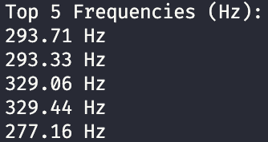

# melody-to-words

Melody-to-Words is an assistive, music-driven speech reinforcement system designed to explore whether melody-based interactions can help encourage language development in early childhood.

This project is personal — I began developing it for my daughter, who is currently undergoing speech therapy and communicates more comfortably through music than spoken words. The goal is not to replace speech therapy, but to experiment with interactive tools that support repetition, association, and confidence through play.

## Project Motivation

Many children with speech delays:

- Communicate more freely when melody removes pressure
- Respond strongly to repetition and rhythm
- Engage well with multisensory feedback (sound + visual + positive reinforcement)

If a child can press keys and hear associated words or sentences, we may create:

- A playful environment with low verbal pressure
- Repetition without boredom
- A sense of control and achievement

This project explores that possibility through software and machine learning.

## How the System Works

1. Child plays melody
2. System captures audio (file-based or real-time)
3. Note pattern is extracted using FFT + signal processing
4. ML model maps melody → word
5. The app speaks the word using text-to-speech
6. Repetition reinforces association

## How FFT Helps Machine Learning Understand Sound

Raw audio is a continuous, unstructured waveform — machines cannot meaningfully learn from it as-is.

Fast Fourier Transform (FFT) converts sound into frequency components, separating complex waves into individual sine waves with measurable:

- Frequency (pitch)
- Amplitude (volume)
- Phase (timing)

This transforms sound into numerical features — a format suitable for machine learning models.

## Current Stage: Frequency Peak Extraction & Real-Time Capture

This repository currently includes:

- **Week 1 — `audio_fft.py`**: Loads `.wav` files, applies FFT to convert waveform to frequency domain, extracts top 5 frequency peaks, prints results to console.
- **Week 2 — `mic_stream_fft.py`**: In-progress real-time microphone streaming using `sounddevice`. Captures audio in small chunks, computes FFT, prints simplified amplitude bands in real time.
- **Week 3 — `melody_to_notes.py`**: Converts top FFT frequencies from audio into musical note names, enabling symbolic note detection for downstream ML mapping.
- **Assets**: `piano.wav` as reference WAV file for testing FFT logic.

This forms the foundation for note detection, melody mapping, and real-time interaction.

## Developer / Copilot Instructions

See [.github/copilot-instructions.md](.github/copilot-instructions.md) for detailed guidance:

- Architecture overview and data flow
- Key FFT processing patterns
- Dependencies (`numpy`, `scipy`, `sounddevice`)
- Audio format constraints
- Development priorities (mic streaming → note detection → melody → ML → TTS)
- Naming conventions, feature extraction recommendations, and testing guidance

---

## Next Steps

- Extract melody sequences for ML input
- Train simple model mapping melodies → words
- Integrate TTS for feedback
- Iterate and test with real-time inputs